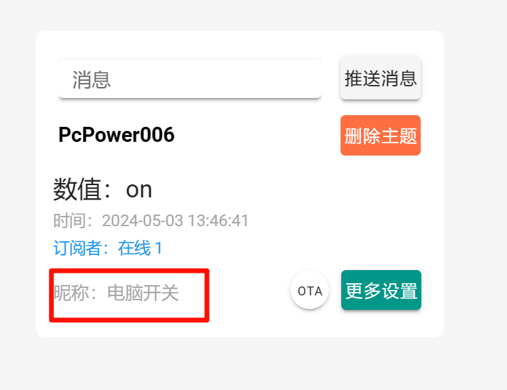
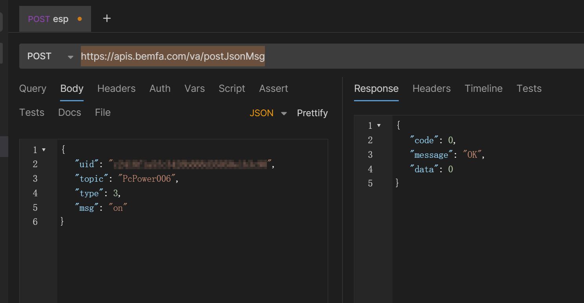
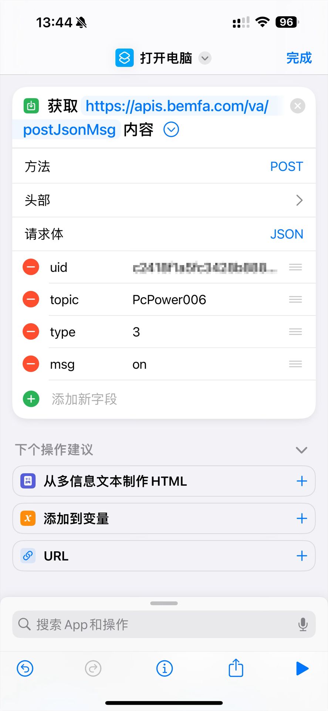
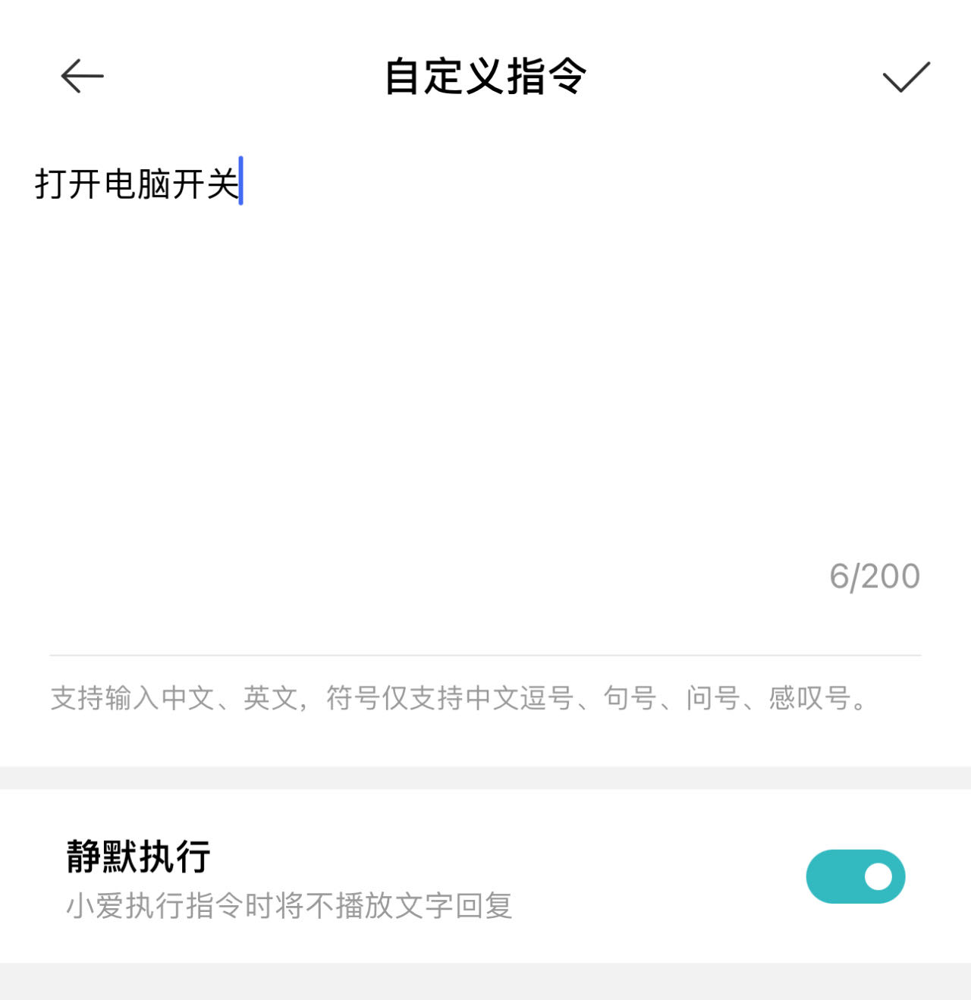
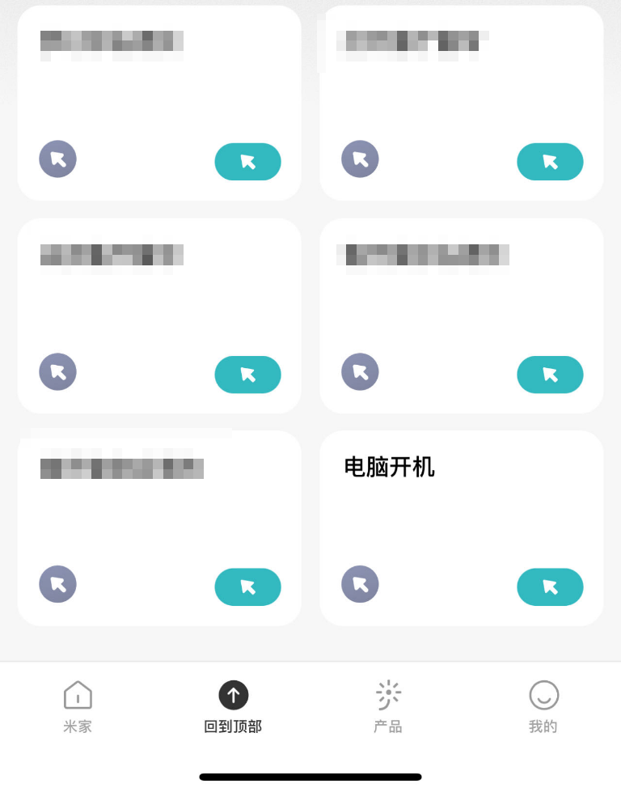

# ESP32 Bemfa wake-on-lan tool
本项目是一个基于 ESP32 的电脑远程开机工具，通过巴法云控制，可以接入米家、天猫精灵等平台，也可通过苹果的快捷指令控制。
>Q：为什么不用插座上电开机？
>
>A：因为:
>1. 插座上电开机太慢了，当插座是接通状态时，需要断电一分钟左右，把主板电容里的电放完，再上电，这样才能开机。WOL 可以秒唤醒
>2. 插座上电开机无法开启睡眠状态的电脑，而通过 WOL 可以唤醒.


## 依赖
本项目使用 Arduino 框架。
- WakeOnLan : https://github.com/a7md0/WakeOnLan
- ESPAsyncWebServer : https://github.com/me-no-dev/ESPAsyncWebServer
- AsyncTCP : https://github.com/me-no-dev/AsyncTCP


## 使用
### 1. 基本
1. 设置电脑的 WOL，确保可以在局域网内用 WOL 唤醒。
2. 创建巴法云账号，新建一个 topic，以 006 结尾。例如：PcPower006。
3. 给 topic 设置一个昵称，如 电脑开关。

4. 设置 main.cpp 中的 SSID、PSW、UID、TOPIC、TARGET_MAC_ADDR。
   ```cpp
   const char *SSID = "xxxx";  // wifi名称
   const char *PSW = "xxxx";  // wifi密码
   const char *UID = "xxxx";  // 巴法云的UID
   const char *TOPIC = "xxxx";  // 巴法云中创建的TOPIC(不是昵称)
   const char *TARGET_MAC_ADDR = "xx:xx:xx:xx:xx:xx";  // 要启动的电脑的MAC地址
   ```
5. 把代码写入 ESP32。
### 2. 调用
#### 通过 HTTP API
1. 参考官方API https://cloud.bemfa.com/docs/src/api_device.html
   
   在 postman 中发送HTTP请求调用
   
2. 发送后 ESP32 上的灯会闪两下，表示调用成功。
3. 测试用过后可以通过苹果的快捷指令调用。


#### 米家
1. 在米家app中添加巴法云，参考：https://cloud.bemfa.com/docs/src/speaker_mi.html
2. 米家：对小爱音箱说：打开电脑开关(你自己设置的topic昵称)。这时ESP32上的LED会闪两下，电脑就启动了。
3. 然后可以在米家的智能里创建一个手动控制，设置小爱音箱的自定义指令，发送”打开电脑开关“，这样就能在米家app里点击就能启动电脑了，不需要喊小爱音箱。



## 扩展指令
本项目只接收一个 ”on“ 指令，调用 WOL 相关方法。

如果要扩展指令的话，使用 BemfaClient 的 addCommand 方法添加指令。
例如添加一个收到 hello 指令时，串口输出 hello world 的方法：
```cpp
 bemfaClient->addCommand("hello", []{
     // Do something
     Serial.println("Hello world");
 });
```